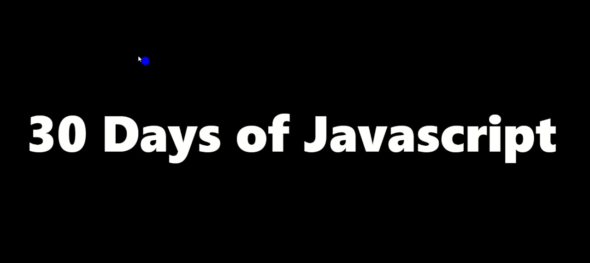
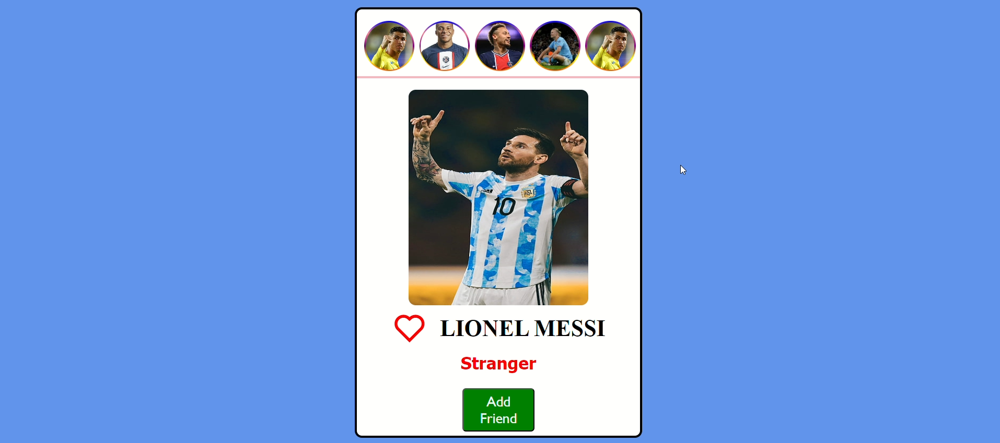
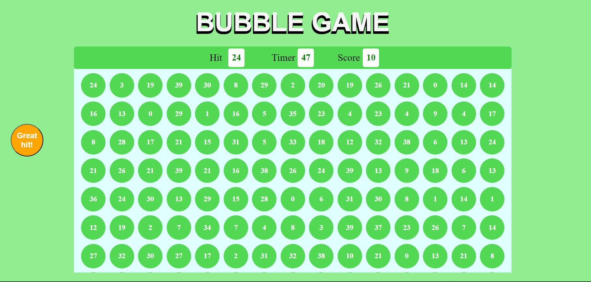

  

## 30 Days Of Js

**Created by Rahul Singh Rawat**

Welcome to the 30 Days of JavaScript Projects challenge! This collection of projects is designed to help beginners learn JavaScript by building practical applications and games. Each project focuses on different aspects of JavaScript, allowing you to gradually improve your skills as you progress through the list.

### Learning Goals

By completing these projects, you will:

- Gain a solid understanding of JavaScript fundamentals, including variables, functions, loops, and conditional statements.
- Learn how to manipulate the Document Object Model (DOM) to create dynamic and interactive web pages.
- Practice problem-solving and debugging skills by working on real-world coding challenges.
- Develop confidence in your ability to build web applications and games using JavaScript.

### Learning Resources

To enhance your learning experience, check out these YouTube channels for tutorials on HTML, CSS, and JavaScript:

- **[Html by Chai aur Javascript (YouTube)](https://www.youtube.com/watch?v=XmLOwJHFHf0&list=PLu71SKxNbfoDBNF5s-WH6aLbthSEIMhMI&pp=iAQB)**
- **[Css by Sheryians Coding School (YouTube)](https://youtu.be/K1naz9wBwKU?feature=shared)**
- **[JavaScript Basics to Advance by Chai aur Javascript (YouTube)](https://www.youtube.com/watch?v=Hr5iLG7sUa0&list=PLu71SKxNbfoBuX3f4EOACle2y-tRC5Q37&pp=iAQB)**

### Getting Started

To get started with the projects, follow these steps:

1. **Clone the Repository:** Clone this repository to your local machine using the following command:git clone https://github.com/rahulrwt05/30-essential-js-mini-projects.git

2. **Explore the Projects:** Navigate to the project directory and explore each mini project. Read the project description, review the code, and try running the project locally in your web browser.

3. **Build Your Own:** Once you're familiar with the projects, challenge yourself to modify and extend them. Experiment with different features, add new functionality, or combine multiple projects into larger applications.

### Live Demo

Check out the live demo of all 30 essential JavaScript mini projects [here](https://your-website.com/projects). This interactive website showcases each project with a brief description, live demo, and individual links to GitHub repositories for further exploration.

### Project List

Here's a list of the 30 essential JavaScript mini projects:

1. Custom Cursor

- Description: Implement a custom cursor effect using JavaScript.
- [Live Demo](https://rahulrwt05.github.io/Custom-Cursor/)
- [GitHub Repository](https://github.com/rahulrwt05/Custom-Cursor)
  

2. Insta Feed

- Description: Recreating the essence of Instagram's feed, featuring interactive like animations, follow/unfollow functionality, and captivating story viewing.
- [Live Demo](https://rahulrwt05.github.io/Insta_feed/)
- [GitHub Repository](https://github.com/rahulrwt05/Insta_feed)
  

3. Bubble Game

- Description: Build a bubble-popping game using HTML, CSS, and JavaScript.
- [Live Demo](https://rahulrwt05.github.io/Bubble-Game/)
- [GitHub Repository](https://github.com/rahulrwt05/Bubble-Game)
  

<!-- Add descriptions and links for the remaining projects -->

### Key Takeaways

As you work through these mini projects, remember to:

- Take your time to understand each concept and experiment with different approaches.
- Don't hesitate to ask questions and seek help from the community or mentors.
- Celebrate your progress and accomplishments along the way!

### Connect with me:

[][website]
[][linkedin]

 

[website]: https://rahulrwt05.vercel.app/
[linkedin]: https://www.linkedin.com/in/rahulrwt05/

Happy coding! 🚀
